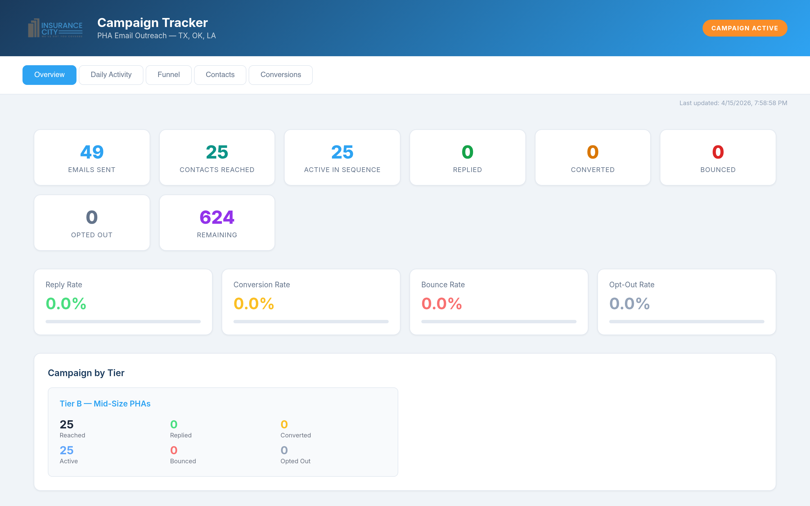
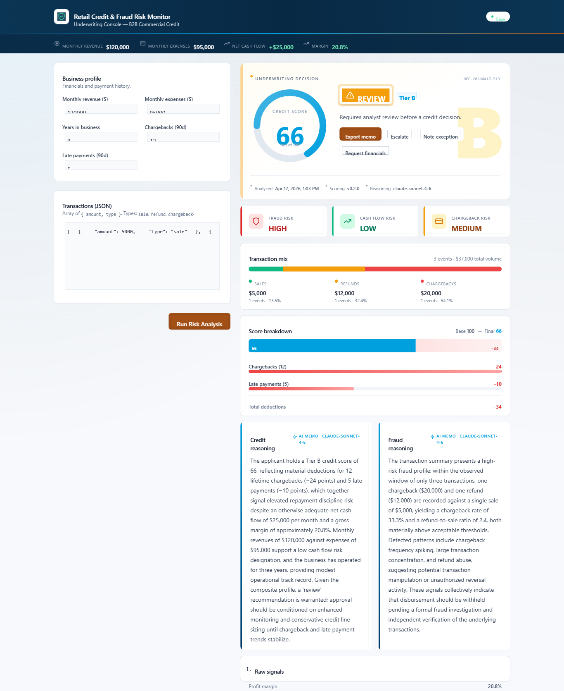
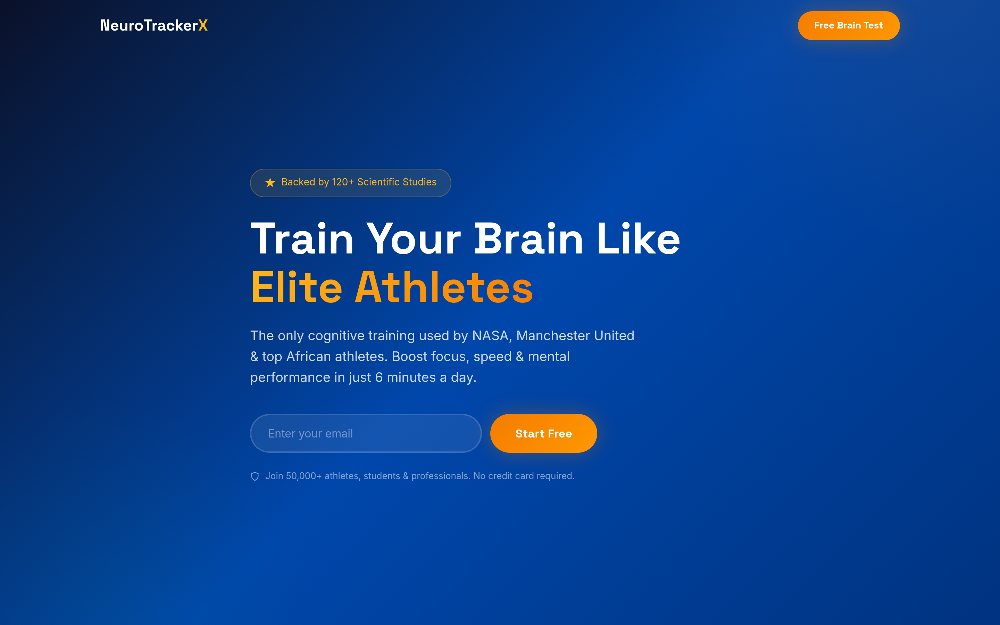

# Charles Mutamiri — AI Product Portfolio

**Product Manager | Generative AI Consultant | LLM & Agentic AI**

I build and ship production AI-powered products — from concept through deployment. This portfolio showcases real-world projects I've designed, built, and deployed using modern AI tools and frameworks.

---

## Featured Projects

### 1. [Insurance City](https://theinsurancecity.com/) — AI-Powered Marketing Consultation ⭐
**Engagement:** Marketing consultation for a multi-million dollar insurance brokerage in Dallas — [theinsurancecity.com](https://theinsurancecity.com/)
**Stack:** Anthropic Claude · Node.js · HawkSoft API · Nodemailer · Office 365 SMTP · Vercel · Calendly

*Live campaign dashboard: emails sent, contacts reached, replies, conversions, bounces — all updating in real time.*

A two-phase consulting engagement for a Dallas-based multi-million dollar independent insurance brokerage with a licensed territory across Texas, Oklahoma, and Louisiana. Scoped, built, and delivered solo.

**Phase 1 — Real-time operations dashboard.** Replaced ten hours/week of manual spreadsheet reporting with a live dashboard pulling directly from their HawkSoft agency management system. Five pipelines (New Business, Cancellations, Pending Renewals, Pipeline, Agency Performance) auto-refreshed every morning.

**Phase 2 — AI-powered outbound campaign.** Designed and built an LLM-orchestrated email system to reach **649 Public Housing Authorities (PHAs)** across their territory with personalized property-insurance renewal outreach — a volume that would have required a dedicated business development team to execute manually.

**The AI architecture worth calling out:** I kept the LLM out of the send loop. Claude handles judgment — contact segmentation, sequence copy, brand-voice review. A deterministic Node.js engine handles execution — daily ramp-up (25 → 35 → 50/day), state tracking, deliverability safeguards, per-send dedup, process locking. The founder monitors both phases through **live real-time dashboards** — no logins, always fresh.

**Next steps (Phase 3+):**
- Extend the campaign framework to the brokerage's other commercial lines (habitational, non-profit, municipal, artisan contractors)
- Layer in **AI-enabled outbound voice calls** — an AI agent that qualifies prospects, answers baseline questions, and books warm calls directly onto the producer's calendar. Email opens the door; AI voice closes the gap between interest and conversation.
- Graduate the PHA playbook into a repeatable niche-marketing product the brokerage can run for every vertical in their pipeline

**Outcomes:**
- Dashboard: eliminated ~10 hrs/week of manual reporting
- Campaign: live since Apr 15, 2026 — running unattended on a 30-day schedule
- Day 1: 25 PHAs reached, 0 bounces, $0/mo SaaS cost
- Replaced an estimated 3 weeks of manual outreach work
- Full audit trail — every send timestamped and recoverable

🔗 **Campaign Dashboard (live metrics):** [campaign-dashboard-mu-two.vercel.app](https://campaign-dashboard-mu-two.vercel.app)
🔗 **Ops Dashboard:** [hawksoft-dashboard.vercel.app](https://hawksoft-dashboard.vercel.app)
🔗 **Agency Landing Page:** [insurance-city-nextjs.vercel.app](https://insurance-city-nextjs.vercel.app)
🔗 **Client Site:** [theinsurancecity.com](https://theinsurancecity.com/)

📂 [View full case study →](projects/insurance-city-pha-campaign.md)

---

### 2. [AI Credit Underwriter](https://credit-fraud-monitor.onrender.com) — Retail Trade-Credit & Fraud Risk Engine ⭐
**Stack:** Node.js · Express · React · Vite · Anthropic Claude Sonnet 4.6 · Docker · Render

A production-grade fintech underwriting console that evaluates retail-business creditworthiness and scans transaction streams for fraud — the kind of internal tool a BNPL provider, wholesale distributor, or merchant-finance platform would use to decide whether to extend trade credit.

**What it does end-to-end (one API call):**
- Ingests a business profile (revenue, expenses, tenure, chargebacks, late payments) plus recent transactions
- Computes a 0–100 credit score + A/B/C/D tier via a **deterministic rules engine**
- Scans transactions for three fraud patterns (chargeback frequency spikes, large-transaction density, refund abuse)
- Produces an approve/review/deny recommendation — with a **fraud override** that downgrades approvals to review when fraud risk is high
- Generates two short **AI-written underwriting memos** (credit + fraud) grounded strictly in the computed signals
- Returns a full audit envelope: request ID, timestamp, scoring version, model name, deduction breakdown

**The AI architecture worth calling out:** same principle as Insurance City — LLM for judgment, deterministic code for the math. The credit score, tier, risk levels, and recommendation are all pure functions that are **unit-testable and auditable** (22 tests cover the scoring rules, threshold caps, and fraud override edge cases). Claude writes the narrative layer on top of those numbers. When the API key is absent or the model fails, the service **falls back to a deterministic narrative with no UX regression** — the app stays fully functional without the LLM.

**Production hardening:** per-IP sliding-window rate limiting, CORS allowlist, request-ID tracing in every log line and error response, React error boundary, input validation at the boundary, single-origin Dockerized deployment.

*Underwriting decision dashboard: score gauge, tier, recommendation, risk badges, score-breakdown waterfall, AI-written memos, and audit footer.*

🔗 **Live demo:** [credit-fraud-monitor.onrender.com](https://credit-fraud-monitor.onrender.com)
🔗 **Repo:** [github.com/mutamiri-sudo/ai-credit-underwriter](https://github.com/mutamiri-sudo/ai-credit-underwriter)

> Free Render tier — cold start after 15 min idle takes ~30s.

---

### 3. BRD Agent — AI-Automated Requirements-to-Backlog Pipeline
**Stack:** Claude Code · Claude API · Node.js · Jira REST API · Prompt Engineering · AI Evals

A Claude Code–powered agent that automates the entire manual workflow of turning a Business Requirements Document into a fully-structured Jira backlog. Instead of a PO / BA spending 1–2 weeks manually adding requirements to Jira as features and then breaking them down into user stories, the agent does it end-to-end:

- Parses the BRD into structured sections
- Creates features in Jira directly via API
- Breaks each feature down into user stories with acceptance criteria
- Generates Gherkin test scenarios for QA handoff
- Tags compliance-relevant stories for regulatory review
- Links everything back to the BRD section it came from (audit-ready traceability)

**Customizable:** plug in your own BRD templates, Jira schema, story-writing conventions, and compliance rules (SOX, HIPAA, NAIC, CFPB, etc.).

**Architectural principle:** LLM for judgment, deterministic code for execution. Claude handles decomposition and language. A deterministic Jira integration layer handles the API calls and linking. Human-in-the-loop checkpoint before anything writes to Jira.

📂 [View project details →](projects/brd-agent.md)

---

### 4. Gherkin Scenario Generator — Jira / Jira Align Integration
**Stack:** Claude API · Node.js · Jira REST API · Jira Align API

A personal project exploring how LLMs can cut the time Product Owners spend on test documentation. Pulls user stories and acceptance criteria from Jira / Jira Align, generates BDD-style Gherkin scenarios, and writes them back to the story.

**Why I built it:**
In my day job as a PO, writing Gherkin scenarios for a full backlog was one of the most time-consuming parts of sprint prep. I wanted to test whether an LLM could meaningfully reduce that overhead without sacrificing scenario quality.

**Outcomes:**
- Measurable reduction in documentation time per story
- Scenarios preserve Given/When/Then rigor for QA handoff
- Proved the pattern for LLM + enterprise tool integration (applies to Confluence, Azure DevOps, etc.)

📂 [View project details →](projects/gherkin-generator.md)

---

### 5. SAFe Cert RAG — Retrieval-Augmented Study Assistant
**Stack:** Node.js · React · RAG Architecture · Vector Embeddings · Claude API

A RAG-powered Q&A tool I built while studying for SAFe Practitioner 6.0 certification. Ingests the SAFe reference library, embeds it, and answers exam-style questions with citations back to source material.

🔗 **Repo:** [github.com/mutamiri-sudo/safe-cert-rag](https://github.com/mutamiri-sudo/safe-cert-rag)

---

### 6. VOLT Supply — E-Commerce Backend & Product Sync Engine
**Stack:** JavaScript · Shopify API · DigiKey API · Railway · Node.js

Backend system for an electronics supply e-commerce store. Automates product catalog management, pricing, and inventory sync between DigiKey (distributor) and Shopify (storefront).

**Key features:**
- Automated product sync between DigiKey distributor catalog and Shopify storefront
- Dynamic pricing engine with markup rules and margin management
- SEO-optimized product feed generation for Google Shopping
- Deployed on Railway with automated scheduling

📂 [View project details →](projects/volt-supply.md)

---

### 7. NeuroTracker — Affiliate Landing Page & Funnel
**Stack:** Next.js · Vercel · Conversion-optimized copy · AI-assisted content

A conversion-optimized affiliate landing page for a cognitive-training platform targeting high-performance sports audiences. Built end-to-end — copy, design, deploy, analytics.

🔗 **Live:** [neurotrackerx-landing.vercel.app](https://neurotrackerx-landing.vercel.app)

📂 [View project details →](projects/neurotracker-landing.md)

---

### 8. DLA GovCon Course — Productized Consulting Offering
**Stack:** Course production · Sales funnel · Marketing automation

A 7-module course teaching small businesses how to win Defense Logistics Agency contracts. Three tiers ($297 / $997 / $2,497) with an upsell pipeline from the companion published book.

📂 [View project details →](projects/dla-govcon-course.md)

---

### 9. HVAC Lead-Gen Website — Built & Listed for Sale on Flippa
**Stack:** WordPress · Elementor · SEO · Conversion-focused UX

A turnkey HVAC lead-generation website built from scratch as a productized digital asset — not a client engagement. SEO-optimized, mobile-responsive, conversion-focused. Listed on [Flippa](https://flippa.com/12756707-turnkey-hvac-lead-generation-website-on-wordpress-elementor-seo-optimized-mobile-responsive-conversion-focused-ready-to-monetize-in-a-288b-industry) for resale to local HVAC operators, agencies, or affiliate buyers wanting a plug-and-play lead funnel in a $288B industry.

Demonstrates a different skill from consulting work: niche selection, end-to-end product ownership, and packaging for resale.

🔗 **Flippa Listing:** [View asset →](https://flippa.com/12756707-turnkey-hvac-lead-generation-website-on-wordpress-elementor-seo-optimized-mobile-responsive-conversion-focused-ready-to-monetize-in-a-288b-industry)

📂 [View project details →](projects/hvac-website.md)

---

### 10. "$38 Billion Opportunity" — AI-Co-Authored Published Book
**Format:** Published Book (Amazon, under pen name)

*A Beginner's Guide to Winning DLA Contracts.* A full-length non-fiction book on winning Defense Logistics Agency contracts — **written and edited in collaboration with Claude** and published under the pen name Marcus Grant. I owned topic selection, outline, research, fact-checking, publishing, and marketing; Claude handled drafting and editorial passes.

Transparent about AI co-authorship. The book is a product experiment in using LLMs as a production tool for long-form content, and a lead magnet feeding the DLA GovCon Course.

🔗 **Buy on Amazon:** [a.co/d/0cbzWrju](https://a.co/d/0cbzWrju)

📂 [View project details →](projects/dla-book.md)

---

## About Me

Product Manager / Product Owner / BA with **8+ years** across **Synchrony Financial (formerly GE Capital), LoanDepot, KPMG, General Motors, American Express, and Ping Golf (via Insight Global)**. Now consulting as a Generative AI Product Consultant, building production AI tools and agentic systems for mid-market clients.

**What I work with daily:** Claude API · Claude Code · Cursor · Lovable · Bolt.new · Prompt Engineering · Agentic Workflows · RAG Architecture · AI Evals · Node.js · React · Next.js

**Certifications:** CSM · PMI-ACP · SAFe 6 POPM

📧 mutamiri@gmail.com
🔗 [LinkedIn](https://www.linkedin.com/in/charlesnmutamiri/)
