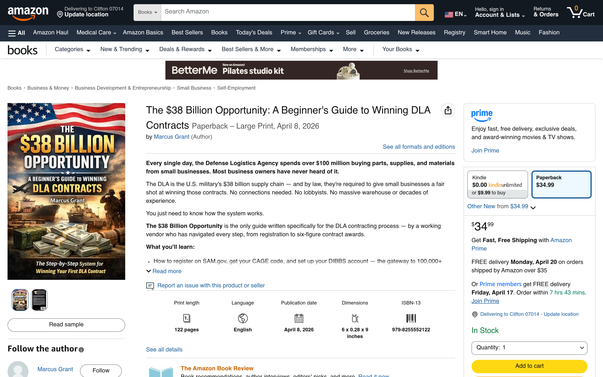

# "$38 Billion Opportunity" — AI-Co-Authored Published Book

*A Beginner's Guide to Winning DLA Contracts*
**Published under the pen name [Marcus Grant](https://a.co/d/0cbzWrju) on Amazon**

[](https://a.co/d/0cbzWrju)

🔗 **Buy on Amazon:** https://a.co/d/0cbzWrju

---

## What This Is

A full-length published guide on how small and mid-size businesses can win Defense Logistics Agency (DLA) contracts. The DLA spends over **$100 million/day** buying parts, supplies, and materials from small businesses — most of it won by a small pool of familiar contractors because the on-ramp (SAM registration, CAGE codes, DIBBS navigation, past-performance building) is opaque to newcomers. This book makes that on-ramp legible.

Available on Amazon in paperback ($34.99), large print, and Kindle ($9.99 or free on Kindle Unlimited) under the pen name Marcus Grant. Published April 8, 2026.

---

## How It Was Made — Transparent AI Co-Authorship

This book is a **product experiment in AI-co-authored non-fiction.** I want to be upfront about that:

- **Content generation:** Claude (Anthropic) drafted the core chapters from my outlines, research inputs, and domain prompts
- **Editing:** Claude handled structural editing, tone consistency, and readability passes
- **My role:** topic selection, research direction, outline design, fact-checking against DLA source material, final review, publishing, marketing, and commercial positioning
- **Pen name:** I published under a pseudonym because the book is a commercial product, not a claim to authorship as a domain expert

This is the same pattern I apply to client work: **LLM for language and synthesis, human for judgment and accountability.** The book is the output. I own the strategy, the market fit, and the P&L. Claude did the typing.

---

## Why It's in the Portfolio

Not because it's an AI engineering project — it isn't. It's in the portfolio because it demonstrates:

- **Product thinking end-to-end** — market research → content strategy → production → publishing → marketing → distribution
- **AI as a production tool, not a gimmick** — I used LLMs to compress what would have been a 6-month writing project into a few weeks without pretending the AI wasn't involved
- **Commercial discipline** — the book is a lead magnet for the DLA GovCon Course ($297–$2,497). It's one piece of a tiered content-to-high-ticket funnel

---

## The Funnel It Feeds

```
Book (Amazon, $9.99–$34.99)
   ↓  lead magnet: free DLA cheat sheet
Email sequence
   ↓  qualifies buyers interested in doing rather than reading
DLA GovCon Course ($297 / $997 / $2,497)
```

The book is the demand-generation engine — low-cost entry that pre-qualifies buyers. The course is the monetization engine. Both are running.

---

## Available On

🔗 **Amazon:** https://a.co/d/0cbzWrju
Published under the pen name **Marcus Grant**.
