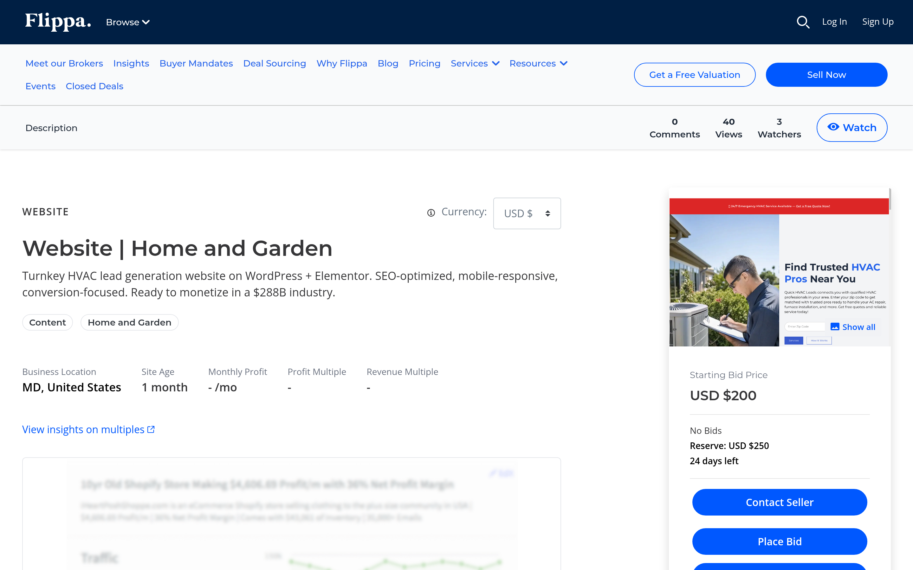

# HVAC Lead-Gen Website — Built & Listed for Sale on Flippa

**Type:** Turnkey website flip — built from scratch and listed for sale
**Role:** Solo builder — niche research, design, build, SEO, conversion copy, listing
**Stack:** WordPress · Elementor · SEO optimization · Mobile-responsive design · Conversion-focused UX
**Status:** Live on [Flippa](https://flippa.com/12756707-turnkey-hvac-lead-generation-website-on-wordpress-elementor-seo-optimized-mobile-responsive-conversion-focused-ready-to-monetize-in-a-288b-industry)

---

## The Play

HVAC is a **$288 billion industry** with a fragmented local-provider landscape, high customer lifetime value, and expensive ad clicks. Local HVAC companies pay heavily for leads — which makes a pre-built, SEO-ready lead-gen site a sellable asset.

I built a turnkey HVAC lead-generation website from scratch — not for a specific client, but as a productized digital asset positioned for sale on Flippa. Buyers are local HVAC companies, marketing agencies, or affiliate operators who want a plug-and-play lead funnel without the 2–3 month buildout.

---

## What's Included in the Asset

- **WordPress + Elementor** build — clean, maintainable, easy for any buyer to operate
- **SEO-optimized** from day one — keyword research, on-page SEO, schema markup, fast load times
- **Mobile-responsive** — most HVAC searches happen on phones
- **Conversion-focused UX** — clear service categories, trust signals, multiple CTA placements, lead capture forms wired up
- **Ready to monetize** — buyer plugs in their service area, phone number, and service details and it's live

---

## Why This Is in the Portfolio

This isn't a client engagement — it's a **productized digital asset**. It belongs in the portfolio because it demonstrates a different skill from consulting work:

- **Niche selection** — identifying a vertical with buyer demand, high margins, and strong search intent
- **End-to-end product ownership** — research → build → SEO → conversion optimization → listing → marketing
- **Packaging for resale** — designing something generic enough to be sold and specific enough to be valuable

The same muscle that turns a BRD into a shipped feature turns a market gap into a listed asset.

---

## Live Listing

🔗 **Flippa:** https://flippa.com/12756707-turnkey-hvac-lead-generation-website-on-wordpress-elementor-seo-optimized-mobile-responsive-conversion-focused-ready-to-monetize-in-a-288b-industry
